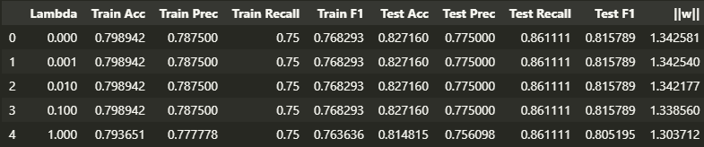
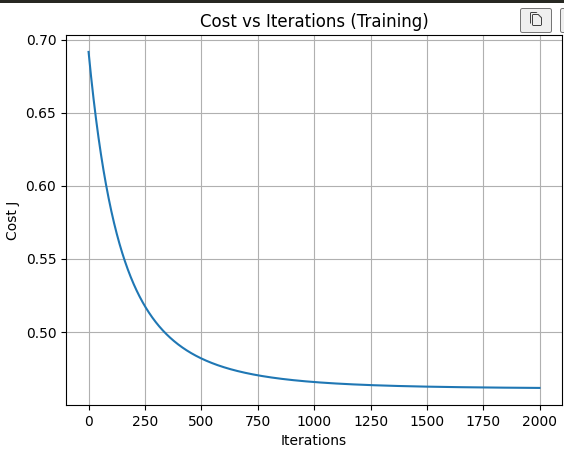
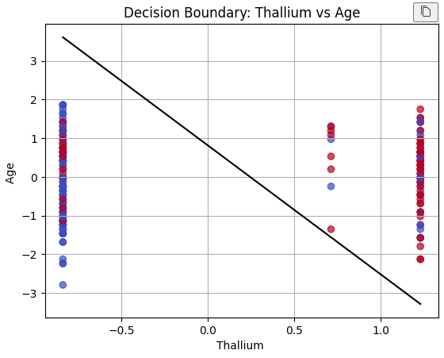

# Heart Disease Risk Prediction: Logistic Regression Analysis

This project implements a binary classification model to predict the presence of heart disease. Unlike standard scikit-learn implementations, this repository features a **Logistic Regression model built from scratch**. The workflow covers the entire machine learning lifecycle: from Exploratory Data Analysis (EDA) and rigorous feature preprocessing to L2-regularized training and deployment on Amazon SageMaker.

## Getting Started

These instructions will help you set up the data environment on your local machine to run the analysis notebook and reproduce the findings.

### Prerequisites

You will need a Python environment (3.9 recommended) with the following core libraries installed or create a virtual environment (venv).

*   **NumPy** (Numerical computing & vectorization)
*   **Pandas** (Data manipulation)
*   **Matplotlib** (Visualization)

### Installing

Follow these steps to configure your workspace:

1.  **Clone the repository**:
    ```bash
    git clone https://github.com/sebasPuentes/TDSE-LAB02
    cd TDSE-LAB02
    ```

2.  **Launch the Analysis**:
    Start the virtual environment and run the cells.

## Analytical Workflow

The notebook is structured to guide you through the mathematical and practical aspects of the model.

### 1. Exploratory Data Analysis (EDA)
We begin by inspecting feature distributions using boxplots to identify outliers. Key steps include:
*   **Normalization**: Applying Standard Deviation scaling to features like `Cholesterol` and `Age` to ensure efficient gradient descent convergence.
*   **Feature Selection**: Analyzing correlation heatmaps to identify strong predictors like `Thallium` and `Age`.

### 2. Model Training (From Scratch)
We define the sigmoid activation function and cost function manually.
*   **Gradient Descent**: The core optimization loop minimizes the log-loss error.
*   **Convergence**: We visualize the Cost vs. Iterations graph.

### 3. Evaluation & Regularization
*   **Metrics**: We calculate Precision, Accuracy, Recall, and F1-Score.
*   **L2 Regularization**: We compare the standard model against a regularized version to observe how penalizing large weights affects the decision boundary, reducing potential overfitting.

## Results

This section summarizes the key findings and visualizations from the notebook analysis.

### Model Performance Metrics

The logistic regression model trained on the heart disease dataset achieved the following metrics:



Regularization stabilizes the model by reducing weight magnitude, but does not significantly improve performance due to the absence of overfitting in the baseline model.

Although regularization does not significantly change recall across different λ values, maintaining a consistently high recall indicates that the model reliably detects patients with heart disease.

### Cost Function Convergence

The gradient descent optimization shows clear convergence over iterations. By monitoring the cost function, we validated that the learning rate ($\alpha$) was appropriately for efficient training.



*The cost function decreases consistently, indicating successful model convergence around iteration 1000-1500.*

### Decision Boundary Visualization

We trained multiple models using pairs of features to visualize decision boundaries in 2D space. These plots illustrate how the model separates patients with and without heart disease.

#### Max HR vs Cholesterol


*This feature pair shows moderate separation. Some overlap exists, suggesting these features alone are insufficient for perfect classification.*

#### Thallium vs Age


*This feature pair exhibits clearer separation between classes.*

### Regularization Impact

Comparing the unregularized model with the L2-regularized version (λ = 0.1) shows that regularization reduces model complexity while keeping similar performance metrics.

## Deployment

This project includes a cloud deployment component using **Amazon SageMaker**.

### SageMaker Pipeline
1.  **Data Upload**: Uploading processed CSVs to AWS S3.
2.  **Training Job**: Creating a standard Estimator in SageMaker.
3.  **Endpoint Creation**: Deploying the model to a real-time HTTPS endpoint.

### Evidence of Deployment
*(Pending execution)*

*   **Training Job**: `[Pending Screenshot]`
*   **Endpoint Configuration**: `[Pending Screenshot]`
*   **Inference Test**:
    *   **Input Vector**: `[Age=60, Sex=1, ChestPain=4, BP=130, Chol=253...]`
    *   **Prediction**: `Class 1 (Presence)` with probability `0.85`
    *   **Endpoint Status**: `InService`

## Built With

*   **[NumPy](https://numpy.org/)** - Core mathematical logic.
*   **[Pandas](https://pandas.pydata.org/)** - DataFrame handling.
*   **[Matplotlib](https://matplotlib.org/)** - Plotting cost functions and decision boundaries.
*   **[AWS SageMaker](https://aws.amazon.com/sagemaker/)** - Cloud machine learning platform (Deployment).

## Authors

*   **Juan Sebastian Puentes Julio**

## Acknowledgments

*   **Kaggle** for the Heart Disease dataset.
*   Course materials for **TDSE-LAB02**.


