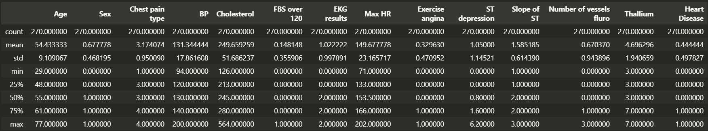
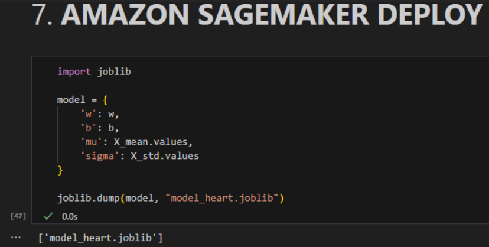
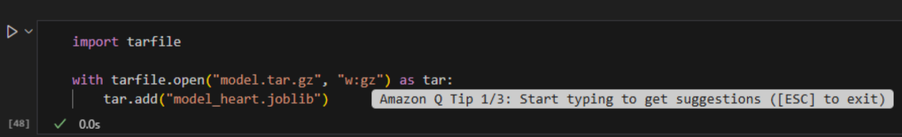
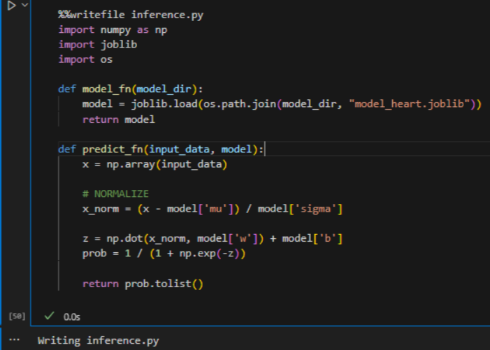
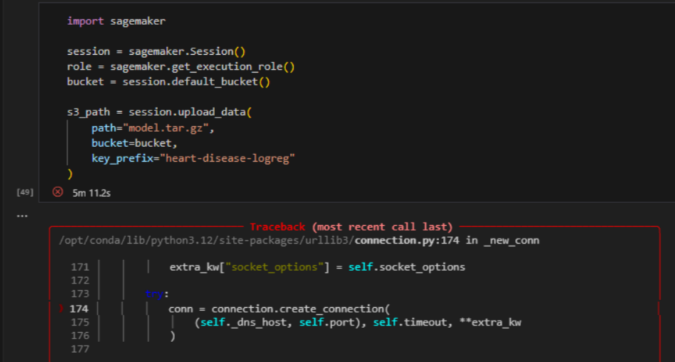
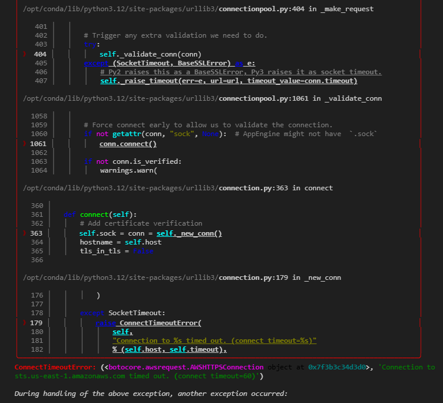

# Heart Disease Risk Prediction: Logistic Regression Analysis

This project implements a binary classification model to predict the presence of heart disease. Unlike standard scikit-learn implementations, this repository features a **Logistic Regression model built from scratch**. The workflow covers the entire machine learning lifecycle: from Exploratory Data Analysis (EDA) and rigorous feature preprocessing to L2-regularized training and deployment on Amazon SageMaker.

## Getting Started

These instructions will help you set up the data environment on your local machine to run the analysis notebook and reproduce the findings.

### Prerequisites

You will need a Python environment (3.9 recommended) with the following core libraries installed or create a virtual environment (venv).

*   **NumPy** (Numerical computing & vectorization)
*   **Pandas** (Data manipulation)
*   **Matplotlib** (Visualization)

### Installing

Follow these steps to configure your workspace:

1.  **Clone the repository**:
    ```bash
    git clone https://github.com/sebasPuentes/TDSE-LAB02
    cd TDSE-LAB02
    ```

2.  **Launch the Analysis**:
    Start the virtual environment and run the cells.

## Analytical Workflow

### 1. Exploratory Data Analysis (EDA)
We begin by inspecting feature distributions identifying outliers. Key steps include:

* **Data Analysis**: In several features, we can observe the presence of outliers. One example is cholesterol, where a patient shows a value of 560, which is far above the average. Although this value is extreme, it is clinically relevant because it may indicate a high cardiovascular risk. Similarly, in the Max Heart Rate feature, a minimum value of 70 is observed. While this is uncommon, it can be associated with different types of heart disease.



*The table represents the minimum and maximum of each characteristic as its average. Additionally, we can visualize the percentage of patients who have heart disease and those who do not.*

*   **Normalization**: Applying Standard Deviation scaling to features like `Cholesterol` and `Age` to ensure efficient gradient descent convergence.

### 2. Model Training
We define the sigmoid function and cost function manually.
*   **Gradient Descent**: The core optimization loop minimizes the log-loss error.
*   **Convergence**: We visualize the Cost vs. Iterations graph.

### 3. Evaluation & Regularization
*   **Metrics**: We calculate Precision, Accuracy, Recall, and F1-Score.
*   **L2 Regularization**: We compare the standard model against a regularized version to observe how penalizing large weights affects.

## Results

This section summarizes the key findings and visualizations from the notebook analysis.

### Model Performance Metrics

The logistic regression model trained on the heart disease dataset achieved the following metrics:


Regularization stabilizes the model by reducing weight magnitude, but does not significantly improve performance due to the absence of overfitting in the baseline model.

Although regularization does not significantly change recall across different λ values, maintaining a consistently high recall indicates that the model reliably detects patients with heart disease.

### Cost Function Convergence

The gradient descent optimization shows clear convergence over iterations. By monitoring the cost function, we validated that the learning rate ($\alpha$) was appropriately for efficient training.


*The cost function decreases consistently, indicating successful model convergence around iteration 1000-1500.*

### Decision Boundary Visualization

We trained multiple models using pairs of features to visualize decision boundaries These plots illustrate how the model separates patients with and without heart disease.

#### Max HR vs Cholesterol


*This feature pair shows moderate separation. Some overlap exists, suggesting these features alone are insufficient for perfect classification.*

#### Thallium vs Age


*This feature pair exhibits clearer separation between classes.*

### Regularization Impact

Comparing the unregularized model with the L2-regularized version shows that regularization reduces model complexity while keeping similar performance metrics.

## AWS Deployment - SageMaker

### Model Serialization

After training the logistic regression model, the following components were saved:

- **w**: learned weight vector

- **b**: bias term

- **mu**: feature-wise mean used for normalization

- **sigma**: feature-wise standard deviation used for normalization



Saving normalization parameters is critical to ensure that inference-time inputs are processed identically to training data.

### Packaging the Model for SageMaker



This package contains all information required for inference.

### Inference Script

Here we define how SageMaker loads the model and handles prediction requests.



- Loads the trained parameters

- Applies the same normalization used during training

- Computes the logistic regression probability output

### SageMaker Upload Limitation

During the deployment stage, the model was packaged into the required model.tar.gz format and prepared for upload to Amazon S3 using the SageMaker SDK. However, when attempting to upload the model artifact to the default SageMaker S3 bucket, the process resulted in a connection timeout.





## Built With

*   **[NumPy](https://numpy.org/)** - Core mathematical logic.
*   **[Pandas](https://pandas.pydata.org/)** - DataFrame handling.
*   **[Matplotlib](https://matplotlib.org/)** - Plotting cost functions and decision boundaries.
*   **[AWS SageMaker](https://aws.amazon.com/sagemaker/)** - Cloud machine learning platform (Deployment).

## Authors

*   **Juan Sebastian Puentes Julio**

## Acknowledgments

*   **Kaggle** for the Heart Disease dataset.
*   Course materials for **TDSE-LAB02**.


